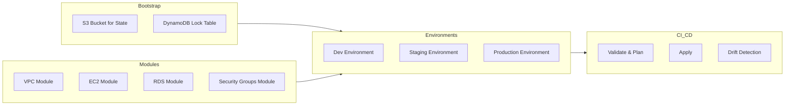

# ARCHITECTURE.md

## Overview
This document describes the high-level architecture of the Terraform-based Infrastructure as Code (IaC) framework for the **terraform-iac-framework** project. It illustrates module interactions, environment layouts, and workflow integrations.

## Architecture Diagram

## Module Interactions
- **VPC Module**: Creates networking foundation (VPC, subnets, IGW, route tables).
- **Security Groups Module**: Defines inbound/outbound rules for EC2 and RDS.
- **EC2 Module**: Launches compute instances within subnets using security groups.
- **RDS Module**: Provisions database instances in private subnets with security groups.

## Environment Layout
- **Dev, Staging, Prod** directories each contain:
  - `backend.conf` for remote state settings
  - `main.tf` to reference modules and configure provider
  - `variables.tf` for environment-specific inputs
  - `terraform.tfvars` with actual values

## CI/CD Workflow
- **Validate & Plan**: Runs on pull requests to check formatting, validation, and plan.
- **Apply**: Executes on pushes to `main` to apply changes to remote environments.
- **Drift Detection**: Scheduled daily to detect and report infrastructure drift.
